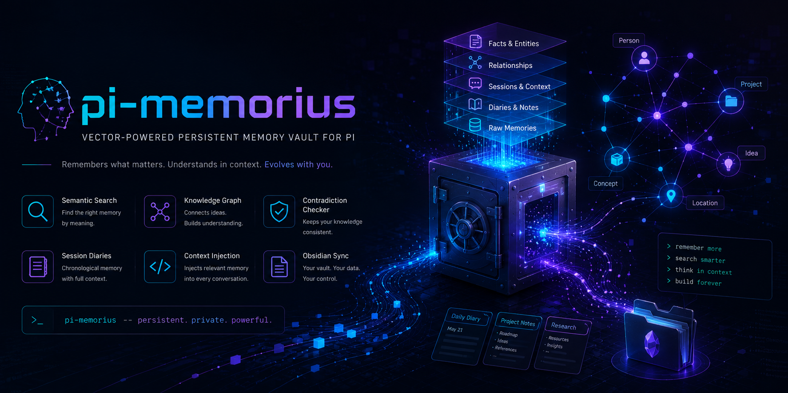

<p align="center">
  
</p>

# 🧠 pi-memorius

**Vector-powered persistent memory extension for Pi-agent** — semantic search, knowledge graph, fact checking, session diaries, memory mining, context injection, and Obsidian sync.

## Why pi-memorius is better

| Feature | pi-hermes-memory | pi-memorius |
|---------|-----------------|-------------|
| Search | SQLite FTS5 (keyword only) | **Vector embeddings (semantic)** |
| Knowledge Graph | No | **Yes — entity relationships** |
| Fact Checking | No | **Yes — contradiction detection** |
| Memory Mining | No | **Yes — auto-extract from conversations** |
| Organization | Flat (MEMORY.md) | **Hierarchical vault/shelf/folder/note** |
| Session Diaries | No | **Yes — structured diary entries** |
| Context Injection | Memory policy text only | **Smart vector-based context injection** |
| Obsidian Sync | No | **Yes — import/export** |
| TUI Components | Basic skills modal | **Rich memory browser + graph viewer** |
| Background Learning | Every 10 turns | **Every 10 turns + tool-call aware** |
| Secret Scanning | Yes | **Also covered by memorius** |

## Quick Start

```bash
# Install
pi install git:github:Dream-Pixels-Forge/pi-memorius

# Or from local
pi install /path/to/pi-memorius
```

Once installed, pi-memorius works automatically:

- **Auto-stores** notable facts from conversations
- **Auto-injects** relevant memories as context
- **Detects corrections** and saves them immediately
- **Mines memories** from complex conversations
- **Tracks relationships** between memories in a knowledge graph

### Commands

| Command | What it does |
|---|---|
| `/memorius-store <content> [--shelf X] [--folder Y]` | Store a memory |
| `/memorius-search <query>` | Semantic vector search |
| `/memorius-context <topic>` | Get context for injection |
| `/memorius-factcheck <statement>` | Check against stored facts |
| `/memorius-diary [--title X]` | Write a session diary entry |
| `/memorius-consolidate` | Merge similar memories |
| `/memorius-mine` | Extract memories from session |
| `/memorius-insights` | Show vault overview |
| `/memorius-stats` | Show memory statistics |
| `/memorius-graph` | Show knowledge graph |
| `/memorius-ls [--vault X]` | List vault structure |
| `/memorius-sync-obsidian` | Sync with Obsidian vault |
| `/memorius-serve-mcp` | Start MCP server |
| `/memorius-interview` | Pre-fill your profile |

### Tools for the LLM

The extension registers custom tools the LLM can call proactively:

- `memorius_store` — Store a memory
- `memorius_search` — Semantic search across memories
- `memorius_context` — Get relevant context for injection
- `memorius_factcheck` — Check a statement against stored facts
- `memorius_mine` — Extract memories from recent conversation
- `memorius_diary` — Write a session diary entry
- `memorius_consolidate` — Trigger consolidation
- `memorius_graph_add` — Add a relationship to the knowledge graph
- `memorius_graph_query` — Query the knowledge graph

## Architecture

```
pi-memorius (pi extension)
├── Backing store: memorius CLI (ChromaDB vector embeddings)
├── pi-native layer:
│   ├── Custom tools (9 tools for LLM)
│   ├── Slash commands (14 commands)
│   ├── Event handlers (auto-store, context injection)
│   ├── Background learning loop
│   ├── Knowledge graph (lightweight JSON-based)
│   ├── Session diary manager
│   └── Rich TUI components
```

## Configuration

Create `~/.pi/agent/memorius-config.json`:

```json
{
  "vault": "main",
  "autoStore": true,
  "autoInject": true,
  "nudgeInterval": 10,
  "nudgeToolCalls": 15,
  "reviewEnabled": true,
  "graphEnabled": true,
  "consolidationThreshold": 0.85,
  "maxSearchResults": 10,
  "maxContextItems": 5,
  "memoriusCliPath": "/home/dimona/.local/bin/memorius"
}
```

## Data Location

```
~/.pi/agent/pi-memorius/
├── graph.json          ← Knowledge graph (entity relationships)
├── sessions.db         ← Session history (SQLite)
└── config.json         ← Extension config
```

Memories themselves are stored by the memorius CLI in `~/.memorius/data/`.

## License

MIT
